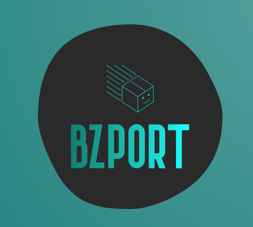
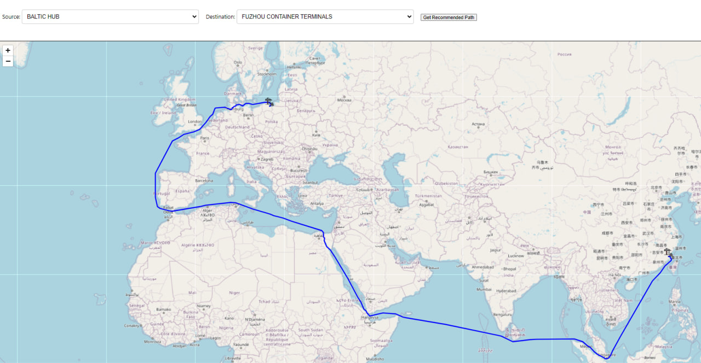

# BZPort



## Table of Contents

- [Project Overview](#project-overview)
- [Tech Stack](#tech-stack)
- [Features](#features)
- [Getting Started](#getting-started)
  - [Prerequisites](#prerequisites)
  - [Installation](#installation)
  - [Running the Application](#running-the-application)
- [Usage](#usage)
- [Contact](#contact)

---

## Project Overview

> Our project aims to optimize the global transportation and shipment of goods by leveraging PSA's node-to-network effect. By integrating data from various PSA locations, we seek to minimize both financial costs and environmental impacts, such as carbon footprint, while maximizing the efficiency of logistics operations. Through advanced analysis of routes and transportation modes, the project will provide data-driven solutions to improve decision-making and reduce the overall environmental and economic burdens of global trade.

---

## Tech Stack

- **Frontend**: React.js
- **Backend**: Firebase
- **Mapping**: React Leaflet
- **Others**: SeaRoute-js

---

## Features

List the main features of your project. For example:

- Real-time data updates with Firebase.
- Map visualization of routes using Leaflet.
- Map visualization of nodes of different types e.g. ports and airports.
- Interactive dropdown menus for selecting source and destination.
- Distance, duration and carbon footprint calculations for the best route.

---

## Getting Started

### Prerequisites

Before you begin, ensure you have the following installed on your system:

- Node.js (>= 14.x)
- npm (or yarn)

### Installation

1. **Clone the repository:**

   ```bash
   git clone https://github.com/chengzihao123/BZPort.git
   cd your-repo
   ```

2. **Install dependencies:**
   ```
   npm install
   ```
   or with yarn:
   ```
   yarn install
   ```

### Running the Application

1. Start the development server:
   ```
   npm start
   ```
   or with yarn:
   ```
   yarn start
   ```
2. Open your browser and navigate to `http://localhost:3000` to view the app.

---

## Usage

Here's how to use the application:

1. **Select Source and Destination:** Use the dropdown menus to select the source and destination nodes (ports or airports).

2. **Visualize Best Route:** The map will automatically update to show the best route between the selected nodes based on distance, duration, and carbon footprint.

3. **Interact with the Map:** The map allows zooming and clicking on nodes for more details.


---

## Contact

If you have any questions, feel free to contact our team:

- Chen Feng: [github](https://github.com/Feng1231)
- Toh Yi Fan [github](https://github.com/TY1Fan)
- Cheng Zi Hao [github](https://github.com/chengzihao123)
